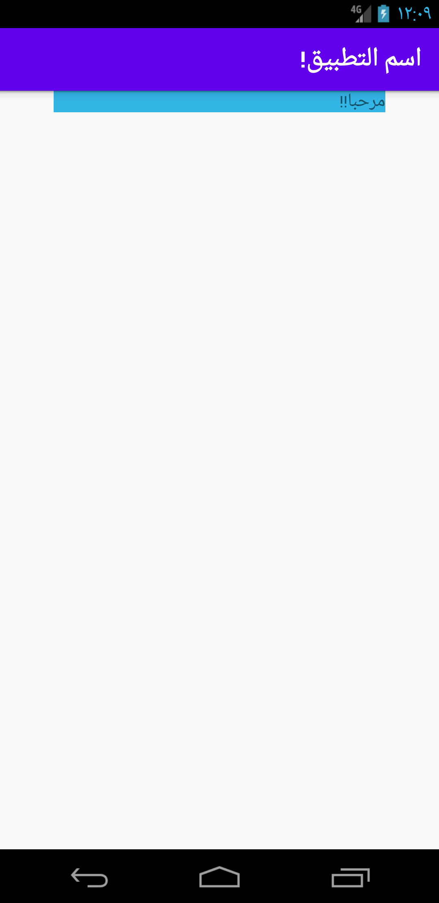
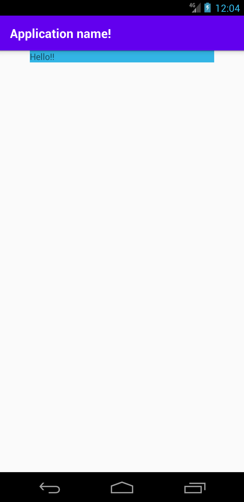
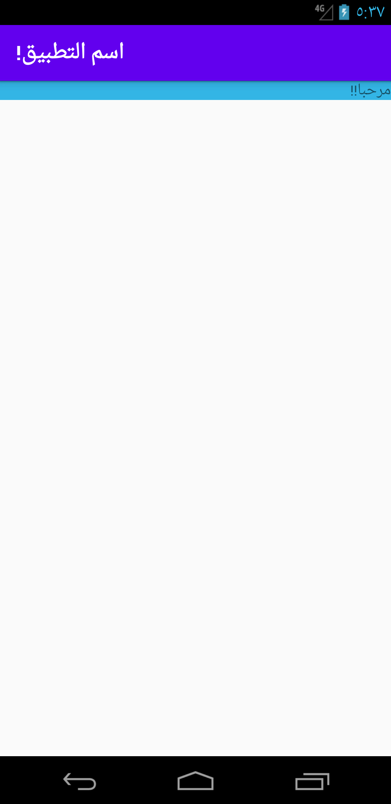
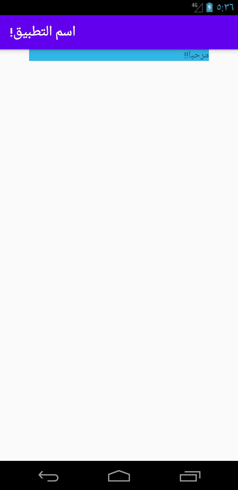
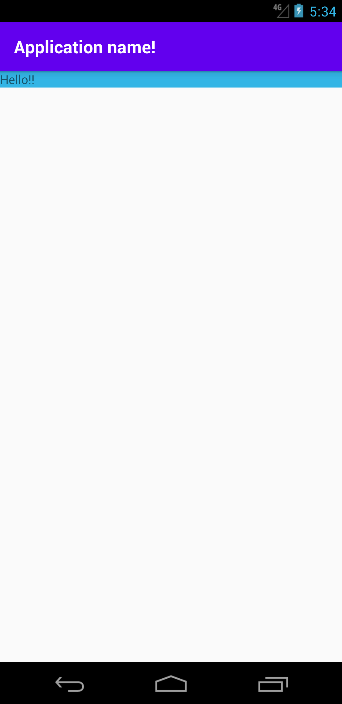
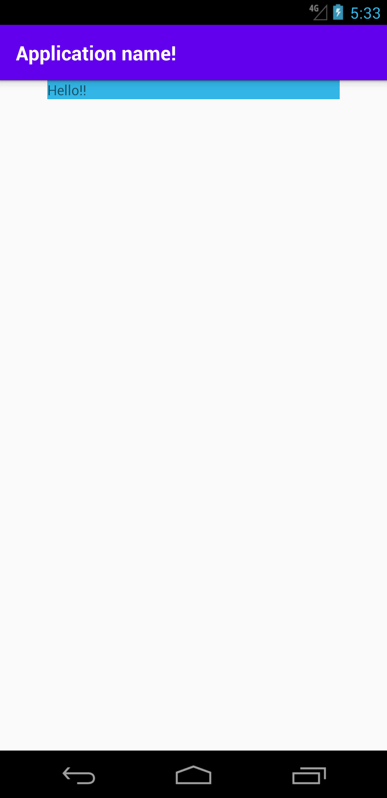

## 結論

アプリがサポートする最小OSバージョンが
OS: 4.2 (minSdkVersion が 17)以上の場合、`layout_marginStart/End` を使用する。 
OS: 4.1 (minSdkVersion が 16)以下の場合、`layout_marginStart/End`に加えて、`layout_marginLeft/Right`  を設定する。 

## 理由
[layout_marginStart](https://developer.android.com/reference/android/view/ViewGroup.MarginLayoutParams#setMarginStart(int)
)  [layout_marginEnd](https://developer.android.com/reference/android/view/ViewGroup.MarginLayoutParams#setMarginEnd(int))はOS: 4.2で追加されたAPIのため、それより古いOSでは、 API Level１から存在する[layout_marginLeft/Right](https://developer.android.com/reference/android/view/ViewGroup.MarginLayoutParams#setMargins(int,%20int,%20int,%20int)) を使う。

アラビア対応も同じく。 
https://android-developers.googleblog.com/2013/03/native-rtl-support-in-android-42.html

## エビデンス
左右にマージンを入れてレイアウトを確認

### OS: 4.2 (言語設定: Arabic)

| layout_marginStart/End | layout_marginleft/Right |
| --- | --- |
|  |  |

### OS: 4.2 (言語設定: English)

| layout_marginStart/End | layout_marginleft/Right |
| --- | --- |
|  |  |

### OS: 4.1 (言語設定: Arabic)

| layout_marginStart/End | layout_marginleft/Right |
| --- | --- |
|  |  |

### OS: 4.1 (言語設定: English)

| layout_marginStart/End | layout_marginleft/Right |
| --- | --- |
|  |  |
